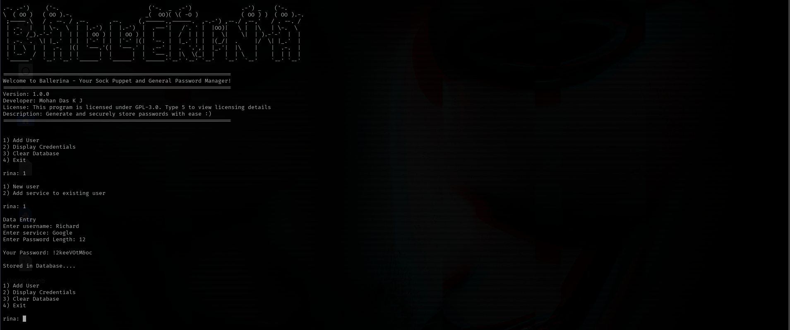

# ballerina
Ballerina is a Secure Password Manager particularly made for Sock Puppet Purposes.Also, it can be used as your general password manager for recommendation of strong password and also for storing them safely in your system.

## Description
Ballerina is a lightweight and secure password manager designed for ethical use,sock puppet and anonymity. It automatically generates strong passwords based on user
preferences and encrypts them for safe storage. Perfect for security enthusiasts and professionals. Ethical Hackers and Penetration testers have to work with many
fake profiles or enormous number of profiles.It's hard to keep track on the **Passwords** of each profile's services(Google,GitHub etc..).So, Ballerina makes it easier to generate and manage passwords for your profiles. Just the name of the profile and length of the password is required.

## Features
- Generates Passwords based on user preferences.
- Secure **Cryptographic based** Encryption for storage of passwords.
- User-Optimized terminal interface.
- Compatible with almost every linux distros(Kali linux,Mint OS,Parrot OS etc...).
- Stores everything offline.So, your passwords remain safe.

## Installation:
1. Download the `.deb` package from the following sources
      - GitHub Release Page: https://github.com/Mohandas-KJ/ballerina/releases
2. Install the package using:
   
   ```bash
   sudo dpkg -i ballerina.deb
4. Run the Program using:
   
   ```bash
   ballerina

## Usage
<p align="center">
  
</p>

1. Select one option among the 4
2. Follow the On-Screen Instructions to generate,store and display the passwords
3. Type 5 to view licensing information

## Requirements
1. Python 3.6 or above
2. Any Linux Distros

Refer to `requirements.txt` to know about the libraries used.

## License
Ballerina is licensed under the GNU General Public License v3.0. See the [LICENSE](https://github.com/Mohandas-KJ/ballerina/blob/main/LICENSE) file for more details.

## Contributing
We welcome contributions! Please fork this repository, create a feature branch, and submit a pull request. See our [Contributing Guidelines](link-to-contributing-file) for more information.

## Contact
For questions or suggestions, reach out at:
- LinkedIn: www.linkedin.com/in/mohandaskj
- Email: mohandaskj.11@gmail.com


   


